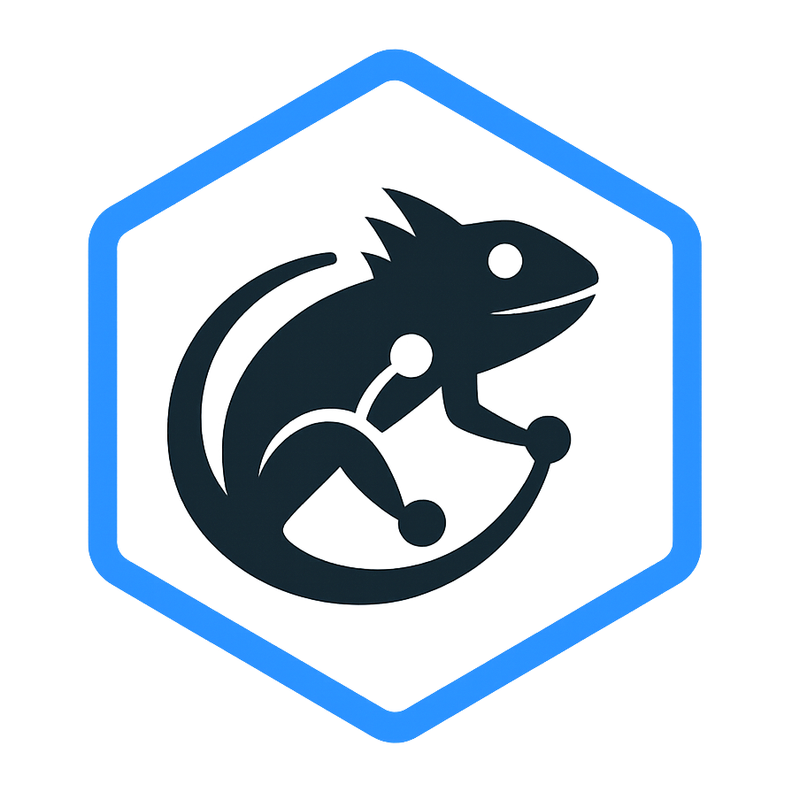

# Shouting Iguana

**Enterprise-grade web crawler and SEO analysis platform built on .NET 9**

Shouting Iguana is a powerful desktop application for comprehensive website auditing and SEO analysis. Whether you're analyzing a small blog or crawling enterprise sites with millions of pages, Shouting Iguana delivers professional-grade insights through an intuitive interface.

## Why Shouting Iguana?

- **Enterprise-Scale Crawling** - Handle sites of any size with efficient SQLite-backed persistence and configurable crawl rules
- **Extensible Plugin System** - Install SEO analysis plugins directly from NuGet or build your own with minimal code
- **Comprehensive Analysis** - Detect broken links, duplicate content, missing meta tags, redirect chains, structured data issues, and more
- **Professional Exports** - Export findings to CSV and Excel for client reports and team collaboration
- **Modern Technology** - Built with .NET 9, WPF, Entity Framework Core, and Playwright for JavaScript rendering

## Built-in Plugins

Shouting Iguana ships with these production-ready plugins out of the box:

| Plugin | What it covers |
| --- | --- |
| Broken Links | Detects broken internal/external links, resources, and soft 404s with detailed diagnostics. |
| Canonical Validation | Canonical URL extraction, validation, chain detection, and cross-domain analysis. |
| Crawl Budget | Crawl budget optimization: soft 404s, server errors, crawled but not indexed pages. |
| Custom Extraction | User-defined data extraction using CSS selectors, XPath, and Regex patterns. |
| Duplicate Content | Exact and near-duplicate content detection using SHA-256 and SimHash algorithms, plus domain/protocol variant validation. |
| Image Audit | Comprehensive image optimization, accessibility, and performance analysis. |
| Internal Linking | Internal link analysis: inlinks, outlinks, anchor text, orphan pages, and link equity. |
| Inventory | Tracks indexability, URL structure, and orphaned pages. |
| International (Hreflang) | Validates hreflang implementation for multi-language and multi-region sites. |
| Link Graph | Internal linking structure showing how pages link to each other with anchor text and link types. |
| List-Mode Crawling | Import and crawl specific URL lists from CSV files with custom priorities. |
| Redirects | Analyzes redirect chains, loops, and canonicalization issues. |
| Robots & Indexability | Robots.txt compliance, meta robots, X-Robots-Tag, and indexability analysis. |
| Security & HTTPS | Validates HTTPS implementation, detects mixed content, and checks security headers. |
| Structured Data | JSON-LD, Microdata, and Schema.org structured data extraction and validation. |
| Titles & Meta | Title, meta, Open Graph, Twitter Cards, and heading structure validation. |
| XML Sitemap | XML sitemap discovery, parsing, validation, comparison, and generation. |

## Getting Started

### Prerequisites

- .NET 9.0 SDK
- Visual Studio 2022 or JetBrains Rider

### Quick Start

1. Build and run the solution

2. Create a new project, configure your crawl settings, and start analyzing!

## Project Structure

The solution is organized into focused projects:

- **ShoutingIguana** - WPF desktop application with modern MaterialDesign UI
- **ShoutingIguana.Core** - Domain models, business logic, and service interfaces
- **ShoutingIguana.Data** - Entity Framework Core data access with SQLite
- **ShoutingIguana.PluginSdk** - SDK for building custom analysis plugins
- **ShoutingIguana.Plugins** - Built-in SEO analysis plugins

## Building Plugins

Shouting Iguana's plugin system lets you extend its capabilities with custom analysis logic. Plugins are distributed via NuGet, making them instantly accessible to all users.

See the [Plugin SDK README](src/ShoutingIguana.PluginSdk/README.md) for a complete guide to building and publishing your own plugins.

## License

This project is MIT [LICENSE](LICENSE) .
